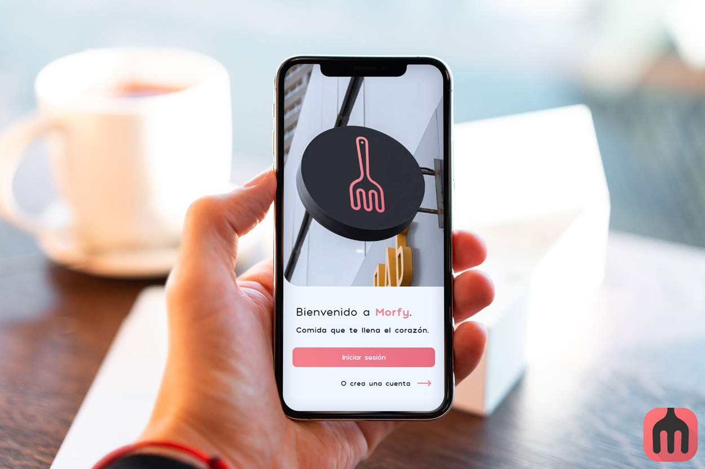
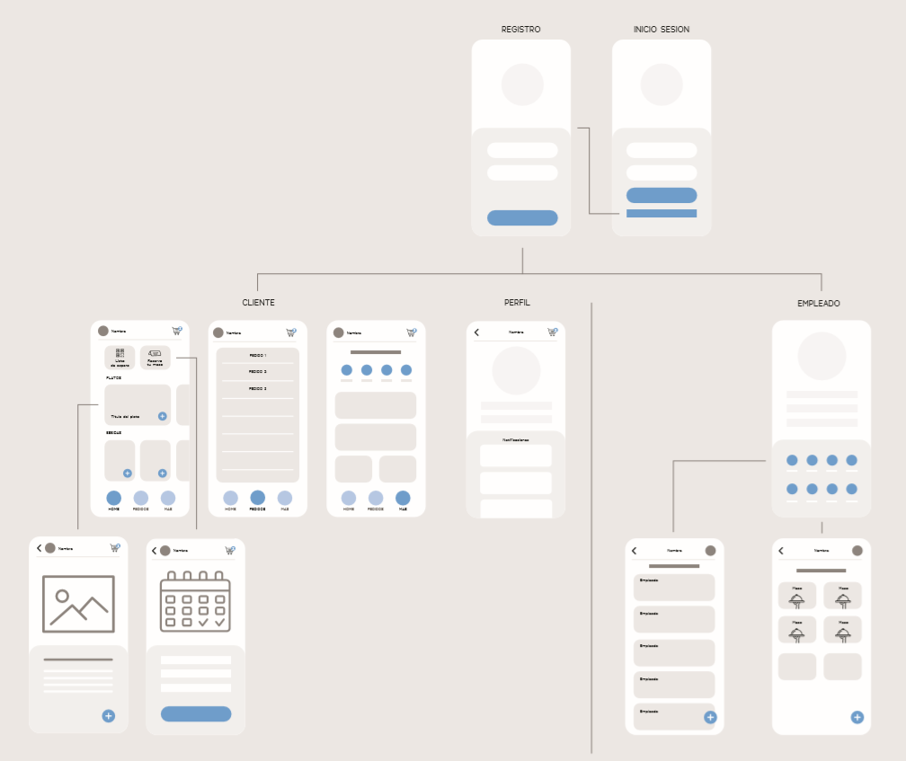
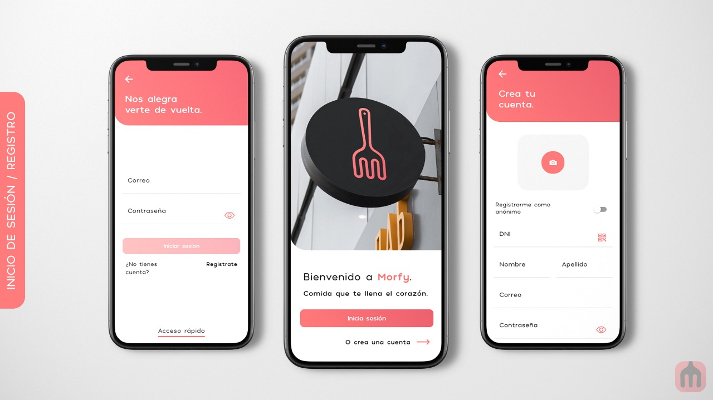
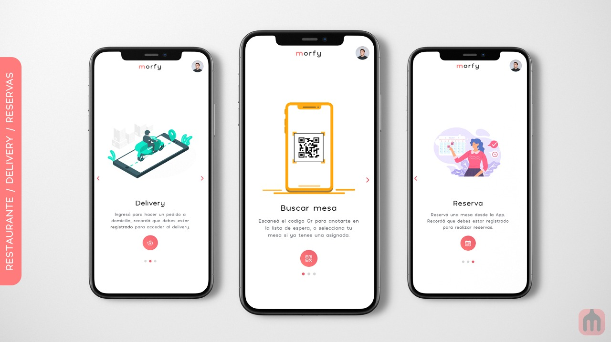
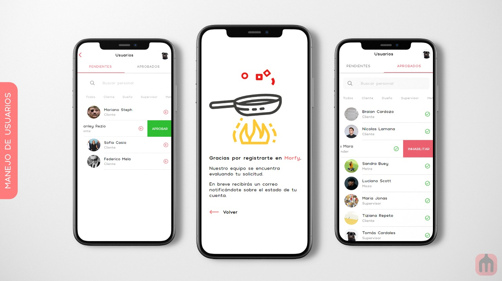
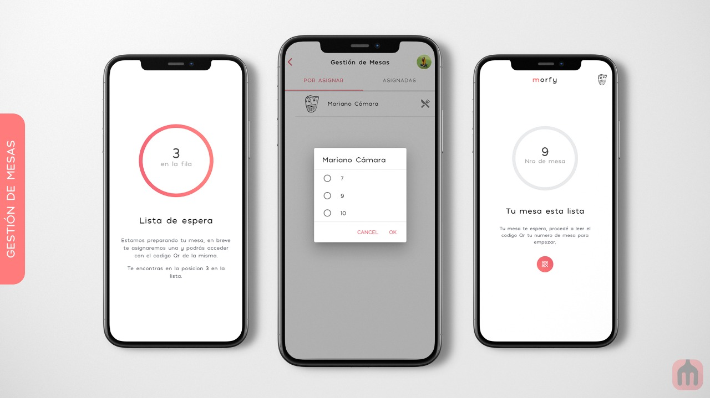
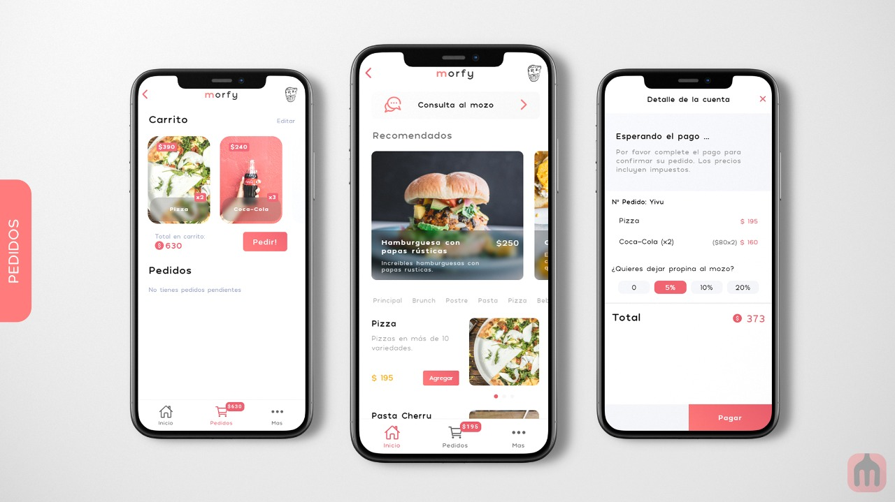
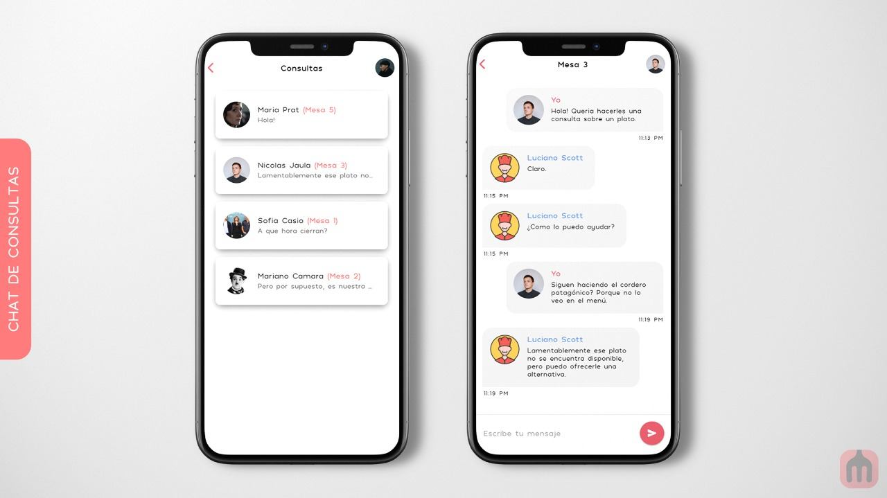
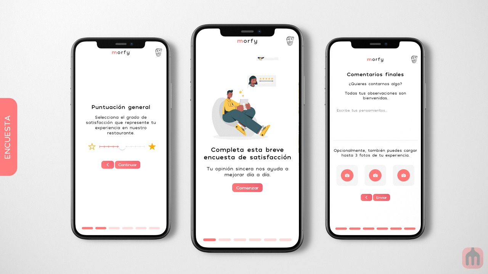
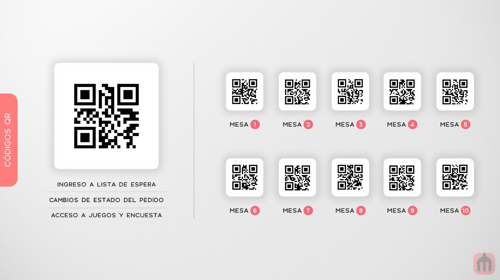

<h1 align="center">Morfy </h1>
 

 

El equipo de Morfy esta ampliamente interesado en que todo usuario que utilice la aplicación pueda acceder sin ningun tipo de inconveniente a cada una de las funcionalidades que la misma tiene. 
Queremos que todo el trabajo que realicemos garantice la comodidad de la totalidad de nuestros usuario y genere una grata mejora en su experiencia de visitar alguno de los locales de nuestros clientes. 

 

 
<h3>Integrantes:</h3> 
<ul>
  <li>Mariano Camara</li>
  <li>Ariel Traut</li>
  <li>Braian Cardozo</li>
</ul>
 

 
<h1>[Sprint 1] 23/05/2020 - 30/05/2020</h1>
 
<<<<<<< HEAD
Objetivos planteados:   
=======

 
Objetivos planteados:  
>>>>>>> 7f24780a368ac447388bb84e5535b88880fb9ff7
1 - Generación del Repositorio. 
2 - Generación de la estructura del proyecto. 
<ul>
  <li>Braian Cardozo</li>
  <li>Fecha Inicio: 24/05/2020</li>
  <li>Fecha Fin: 24/05/2020</li>
  <li>Commit: https://github.com/CardozoBraianEzequiel/2020_TP_PPS_Comanda_1_cuatri/commit/a5b443001bb380b19fdf0d864d862ff616bdb2b1</li>
</ul>
3 - Establecer y coordinar flujo de trabajo en Git. 
<ul>
  <li>Reunión día: 24/05/2020</li>
  <li>Canal: Discord</li>
  <li>Tareas pactadas: 
    <ul>
      <li>Firebase (Braian)</li>
      <li>Login (Mariano)</li>
      <li>Dashboard Empleados (Ariel)</li>
    </ul>
  </li> 
  <li>Conclusiones: 
    <ul>
      <li>El proyecto dio el puntapié inicial.</li>
      <li>Se realizó la puesta en común del flujo git a utilizar.</li>
      <li>Nos propusimos traer propuestas de flow de pantallas, icono y diseño.</li>
      <li>Se pactó otra reunión para el 26/05/2020</li>
    </ul>
  </li>
 </ul>
 <ul>
  <li>Reunión día: 26/05/2020</li>
  <li>Canal: Discord</li>
  <li>Conclusiones: 
    <ul>
      <li>Se seleccionó el diseño de la app.</li>
      <li>Se seleccionó el icono.</li>
      <li>Se seleccionó el flujo de las pantallas.</li>
    </ul>
  </li>
 </ul>
4 - Diseño de Icono. 
<ul>
  <li>Mariano Camara</li>
  <li>Fecha Inicio: 24/05/2020</li>
  <li>Fecha Fin: 24/05/2020</li>
  <li>Commit: https://github.com/CardozoBraianEzequiel/2020_TP_PPS_Comanda_1_cuatri/commit/2a3cdc9a393cbb644244bf03faa79effac8c8d80</li>
</ul>
5 - Generacion de estructura estetica de nuestro proyecto.  
<ul>
  <li>Ariel Traut</li>
  <li>Fecha Inicio: 26/05/2020</li>
  <li>Fecha Fin: 26/05/2020</li>
  <li>Commit: https://github.com/CardozoBraianEzequiel/2020_TP_PPS_Comanda_1_cuatri/commit/72c5761731b9f97969a6f779f5f85624d8ed5f8e</li>
</ul>
6 - Servicio de Firebase. 
<ul>
  <li>Braian Cardozo</li>
  <li>Fecha Inicio: 25/05/2020</li>
  <li>Fecha Fin: 25/05/2020</li>
</ul>
7 - Generación del Login. 
<ul>
  <li>Mariano Camara</li>
  <li>Fecha Inicio: 28/05/2020</li>
  <li>Fecha Fin: 30/05/2020</li>
  <li>Commit: https://github.com/CardozoBraianEzequiel/2020_TP_PPS_Comanda_1_cuatri/commit/c70e9cffcd2091956b2dfd7e2c3d1c55ca7267ce</li>
</ul>
8 - Generación del dashboard de empleados. 
<ul>
  <li>Ariel Traut</li>
  <li>Fecha Inicio: 26/05/2020</li>
  <li>Fecha Fin: 28/05/2020</li>
  <li>Commit: https://github.com/CardozoBraianEzequiel/2020_TP_PPS_Comanda_1_cuatri/commit/72c5761731b9f97969a6f779f5f85624d8ed5f8e</li>
</ul>
9 - Diagrama de flujo de las pantallas. 
<ul>
  <li>Mariano Camara</li>
  <li>Fecha Inicio: 25/05/2020</li>
  <li>Fecha Fin: 25/05/2020</li>
  <li>Commit: https://github.com/CardozoBraianEzequiel/2020_TP_PPS_Comanda_1_cuatri/commit/0f967956da174b6a4cb39a51ca95a9c702db72be</li>
</ul>
10 - Planteo de modelo de datos a utilizar.  
<ul>
  <li>Braian Cardozo</li>
  <li>Fecha Inicio: 29/05/2020</li>
  <li>Fecha Fin: 31/05/2020</li>
  <li>Commit: https://github.com/CardozoBraianEzequiel/2020_TP_PPS_Comanda_1_cuatri/commit/aa429ad20b983b4f5eaab9cb58ce01de63569c1c</li>
</ul> 

9) Diagrama de Flujo:

 
<h1>[Sprint 2] 30/05/2020 - 06/06/2020</h1>
 

 
1) Estructura de pantalla incial de Clientes con info mockeada.   
  <ul>
  <li>Ariel Traut</li>
  <li>Fecha Inicio: 01/06/2020</li>
  <li>Fecha Fin: 02/06/2020</li>
  <li>Commit: https://github.com/CardozoBraianEzequiel/2020_TP_PPS_Comanda_1_cuatri/commit/4e2105977b5e0329cd1b2cd77006a80ee42f61f8</li>
</ul>
2) Registración.  
<ul>
  <li>Mariano Camara</li>
  <li>Fecha Inicio: 01/06/2020</li>
  <li>Fecha Fin: 01/06/2020</li>
  <li>Commit: https://github.com/CardozoBraianEzequiel/2020_TP_PPS_Comanda_1_cuatri/commit/cf4561e20353d00592f637d62db2a6207efd2a94</li>
</ul>
3) Lector QR de DNI.  
<ul>
  <li>Braian Cardozo</li>
  <li>Fecha Inicio: 01/06/2020</li>
  <li>Fecha Fin: 04/06/2020</li>
  <li>Commit: https://github.com/CardozoBraianEzequiel/2020_TP_PPS_Comanda_1_cuatri/commit/e097a597a372d5a967b20b3316aa8d271a4018b3</li>
</ul>
4) Notificacion por Email.  
<ul>
  <li>Mariano Camara</li>
  <li>Fecha Inicio: 03/06/2020</li>
  <li>Fecha Fin: 05/06/2020</li>
  <li>Commit: https://github.com/CardozoBraianEzequiel/2020_TP_PPS_Comanda_1_cuatri/commit/2b2d3431570fd8d7b933b8fb235f8c76e5115623</li>
</ul>
5) Aprobación de usuarios.  
<ul>
  <li>Mariano Camara</li>
  <li>Fecha Inicio: 03/06/2020</li>
  <li>Fecha Fin: 05/06/2020</li>
  <li>Commit: https://github.com/CardozoBraianEzequiel/2020_TP_PPS_Comanda_1_cuatri/commit/2b2d3431570fd8d7b933b8fb235f8c76e5115623</li>
</ul>
6) Agregar al pedido.  
<ul>
  <li>Ariel Traut</li>
  <li>Fecha Inicio: 03/06/2020</li>
  <li>Fecha Fin: 04/06/2020</li>
  <li>Commit: https://github.com/CardozoBraianEzequiel/2020_TP_PPS_Comanda_1_cuatri/commit/e2dda1b76fe424441690707b61414b7e090378fc</li>
</ul>
7) Cargar productos desde base de datos.  
<ul>
  <li>Ariel Traut</li>
  <li>Fecha Inicio: 06/06/2020</li>
  <li>Fecha Fin: 07/06/2020</li>
  <li>Commit: https://github.com/CardozoBraianEzequiel/2020_TP_PPS_Comanda_1_cuatri/commit/e2dda1b76fe424441690707b61414b7e090378fc</li>
</ul>
8) Pagar los datos asociados al pedido.  
<ul>
  <li>Ariel Traut</li>
  <li>Fecha Inicio: 07/06/2020</li>
  <li>Fecha Fin: 07/06/2020</li>
  <li>Commit: https://github.com/CardozoBraianEzequiel/2020_TP_PPS_Comanda_1_cuatri/commit/e2dda1b76fe424441690707b61414b7e090378fc</li>
</ul>
9) Loguearse como usuario anonimo.  
<ul>
  <li>Mariano Camara</li>
  <li>Fecha Inicio: 24/05/2020</li>
  <li>Fecha Fin: 24/05/2020</li>
  <li>Commit: https://github.com/CardozoBraianEzequiel/2020_TP_PPS_Comanda_1_cuatri/commit/2b2d3431570fd8d7b933b8fb235f8c76e5115623</li>
</ul>
10) Agregado de qr al proyecto para control de estados.  
<ul>
  <li>Braian Cardozo</li>
  <li>Fecha Inicio: 06/06/2020</li>
  <li>Fecha Fin: 10/06/2020</li>
  <li>Commit: https://github.com/CardozoBraianEzequiel/2020_TP_PPS_Comanda_1_cuatri/commit/2b2d3431570fd8d7b933b8fb235f8c76e5115623</li>
</ul>
 

 
<h1>[Sprint 3] 06/06/2020 - 13/06/2020</h1>
 

 
1) Cambios de estado de cliente por QR.  
<ul>
  <li>Braian Cardozo</li>
  <li>Fecha Inicio: 06/06/2020</li>
  <li>Fecha Fin: 10/06/2020</li>
  <li>Commit: https://github.com/CardozoBraianEzequiel/2020_TP_PPS_Comanda_1_cuatri/commit/d007f97fae6f68f74a3c133feafee6652577b69e</li>
</ul>
2) Cambios de estado de pedido.  
<ul>
  <li>Ariel Traut</li>
  <li>Fecha Inicio: 10/06/2020</li>
  <li>Fecha Fin: 12/06/2020</li> 
</ul>
3) Splash e Iconografia de la app.  
<ul>
  <li>Mariano Camara</li>
  <li>Fecha Inicio: 10/06/2020</li>
  <li>Fecha Fin: 12/06/2020</li> 
</ul>
4) Consultas al mozo.  
<ul>
  <li>Mariano Camara</li>
  <li>Fecha Inicio: 12/06/2020</li>
  <li>Fecha Fin: </li>
</ul>
5) Reunion semanal.
<ul>
  <li>Reunión día: 10/06/2020</li>
  <li>Canal: Discord / Meet</li>
  <li>Tareas pactadas: 
    <ul>
      <li>Diseño de flujo de estados de cliente y pedido. (Mariano)</li>
      <li>Creacion de flujo de flujo de estados de pedido. (Ariel)</li>
      <li>Creacion de flujo de flujo de estados del cliente (Braian)</li>
    </ul>
  </li> 
  <li>Conclusiones: 
    <ul>
      <li>Tenemos un primer flujo de registración -> Aprobación -> Envio de email -> Ingreso -> Cargar pedido -> Pagar.</li>
      <li>Debatimos acerca de lo que ya tenemos cumplido del pdf.</li>
      <li>Debatimos acerca de los flujos de estados de la app.</li>
      <li>Se tomo la decisión de que en la sala de espera ya puedas agregar productos a tu pedido.</li>
      <li>Se repartieron tareas.</li>
    </ul>
  </li>
 </ul>
 
<h1>[Sprint 4] 13/06/2020 - 20/06/2020</h1>
 

 
- Objetivo del sprint: Poder hacer entrega de los primeros puntos al profesor en video a traves del ClassRoom. (No cumplido)
1) Cambios de estado de cliente por QR.  
<ul>
  <li>Braian Cardozo</li>
  <li>Fecha Inicio: 06/06/2020</li>
  <li>Fecha Fin: 10/06/2020</li>
  <li>Commit: https://github.com/CardozoBraianEzequiel/2020_TP_PPS_Comanda_1_cuatri/commit/d007f97fae6f68f74a3c133feafee6652577b69e</li>
</ul>
2) Borrar Productos.  
<ul>
  <li>Ariel Traut</li>
  <li>Fecha Inicio: 15/06/2020</li>
  <li>Fecha Fin: 17/06/2020</li>
  <li>Commit: https://github.com/CardozoBraianEzequiel/2020_TP_PPS_Comanda_1_cuatri/commit/e5a291f0ed97e7f12166fa03acdf6bf6c5d35017</li>
</ul>
3) Primer notificacion.  
<ul>
  <li>Mariano Camara</li>
  <li>Fecha Inicio: 13/06/2020</li>
  <li>Fecha Fin: 18/06/2020</li>
  <li>Commit: https://github.com/CardozoBraianEzequiel/2020_TP_PPS_Comanda_1_cuatri/commit/d712c46cbbe516e7616919aeb8683f4ef8da0b66</li>
</ul>
3) Disparar notificaciones.  
<ul>
  <li>Mariano Camara</li>
  <li>Fecha Inicio: 18/06/2020</li>
  <li>Fecha Fin: 19/06/2020</li>
  <li>Commit: https://github.com/CardozoBraianEzequiel/2020_TP_PPS_Comanda_1_cuatri/commit/74aea950c2d016547dd964499654ceeeb76e128d</li>
</ul>
 

 
<h1>[Sprint 5] 20/06/2020 - 27/06/2020</h1>
 

 

 
- Objetivo del sprint: Poder hacer entrega de los primeros puntos al profesor en video a traves del ClassRoom. 
1) Gestion de mesas, asignacion por parte del metre  
<ul>
  <li>Braian Cardozo</li>
  <li>Fecha Inicio: 19/06/2020</li>
  <li>Fecha Fin: 23/06/2020</li>
  <li>Commit: https://github.com/CardozoBraianEzequiel/2020_TP_PPS_Comanda_1_cuatri/commit/4673ffbaf60b8c56aa9559540d04987ceea10b50</li>
</ul>
2) Se agrego otro tipo de validación de dni leyendo el qr.  
<ul>
  <li>Braian Cardozo</li>
  <li>Fecha Inicio: 19/06/2020</li>
  <li>Fecha Fin: 23/06/2020</li>
  <li>Commit: https://github.com/CardozoBraianEzequiel/2020_TP_PPS_Comanda_1_cuatri/commit/1025adec9ed1834e998b4e02b7970dad71df8237</li>
</ul>
3) Alertas para los logout y cada vez que pasa algo con los qr.  
<ul>
  <li>Braian Cardozo</li>
  <li>Fecha Inicio: 23/06/2020</li>
  <li>Fecha Fin: 27/06/2020</li>
  <li>Commit: https://github.com/CardozoBraianEzequiel/2020_TP_PPS_Comanda_1_cuatri/commit/5ffa5400e46b3434a427d219881af385bf6e364a</li>
</ul>
4) Se agrega todo el flujo de la consulta al mozo.  
<ul>
  <li>Mariano Camara</li>
  <li>Fecha Inicio: 25/06/2020</li>
  <li>Fecha Fin: </li>
  <li>Commit: https://github.com/CardozoBraianEzequiel/2020_TP_PPS_Comanda_1_cuatri/commit/34df5d73091094917d8726b9a826409a01b0926b</li>
</ul>
5) Logra visualizar el valor de todo lo consumido en el pedido todo el tiempo.  
<ul>
  <li>Mariano Camara</li>
  <li>Fecha Inicio: 25/06/2020</li>
  <li>Fecha Fin: </li>
  <li>Commit: https://github.com/CardozoBraianEzequiel/2020_TP_PPS_Comanda_1_cuatri/commit/34df5d73091094917d8726b9a826409a01b0926b</li>
</ul>
6) Cambio de todo el flujo de los pedidos para poder tener mas de un pedido por usuario.  
<ul>
  <li>Ariel Traut</li>
  <li>Fecha Inicio: 23/06/2020</li>
  <li>Fecha Fin: 01/07/2020</li>
  <li>Commit: https://github.com/CardozoBraianEzequiel/2020_TP_PPS_Comanda_1_cuatri/commit/c6f48af0c20cc0c6d21f3befe64b665eb1aa673f</li>
</ul>
7) Flujo de notificacion por parte del bartender/cocinero.  
<ul>
  <li>Ariel Traut</li>
  <li>Fecha Inicio: 23/06/2020</li>
  <li>Fecha Fin: 01/07/2020</li>
  <li>Commit: https://github.com/CardozoBraianEzequiel/2020_TP_PPS_Comanda_1_cuatri/commit/c6f48af0c20cc0c6d21f3befe64b665eb1aa673f</li>
</ul>
8) Flujo de "terminado" por parte del bartender/cocinero.  
<ul>
  <li>Ariel Traut</li>
  <li>Fecha Inicio: 23/06/2020</li>
  <li>Fecha Fin: 01/07/2020 </li>
  <li>Commit: https://github.com/CardozoBraianEzequiel/2020_TP_PPS_Comanda_1_cuatri/commit/c6f48af0c20cc0c6d21f3befe64b665eb1aa673f</li>
</ul>
 
<h1>[Sprint 6] 27/06/2020 - 04/07/2020</h1>
 

 

 
1) Encuestas del cliente  
<ul>
  <li>Mariano Camara</li>
  <li>Fecha Inicio: 27/06/2020</li>
  <li>Fecha Fin: 02/07/2020</li>
  <li>Commit: https://github.com/CardozoBraianEzequiel/2020_TP_PPS_Comanda_1_cuatri/commit/</li>
</ul>
2) Se agregaron los slides con 3 fotos para los platos y las bebidas.  
<ul>
  <li>Braian Cardozo</li>
  <li>Fecha Inicio: 27/06/2020</li>
  <li>Fecha Fin: 01/07/2020</li>
  <li>Commit: https://github.com/CardozoBraianEzequiel/2020_TP_PPS_Comanda_1_cuatri/commit/3ceb548394fe889f89a22bb55954ffae674bd00c</li>
</ul>
3) Aprobación de platos y bebidas por parte de los bartender y cocineros.  
<ul>
  <li>Ariel Traut</li>
  <li>Fecha Inicio: 30/06/2020</li>
  <li>Fecha Fin: 01/07/2020</li>
  <li>Commit: https://github.com/CardozoBraianEzequiel/2020_TP_PPS_Comanda_1_cuatri/commit/c6f48af0c20cc0c6d21f3befe64b665eb1aa673f</li>
</ul>
4) Creación de varios pedidos por parte de un mismo usuario en una misma sesión.  
<ul>
  <li>Ariel Traut</li>
  <li>Fecha Inicio: 30/06/2020</li>
  <li>Fecha Fin: 01/07/2020</li>
  <li>Commit: https://github.com/CardozoBraianEzequiel/2020_TP_PPS_Comanda_1_cuatri/commit/c6f48af0c20cc0c6d21f3befe64b665eb1aa673f</li>
</ul>
5) Alta de todo tipo de usuarios por parte del supervisor.  
<ul>
  <li>Braian Cardozo</li>
  <li>Fecha Inicio: 29/06/2020</li>
  <li>Fecha Fin: 01/07/2020</li>
  <li>Commit: https://github.com/CardozoBraianEzequiel/2020_TP_PPS_Comanda_1_cuatri/commit/cfffdea938df2c30033d20ee27379e7deb322438</li>
</ul>
6) Confirmación de los pedidos recibidos por parte del usuario.  
<ul>
  <li>Mariano Camara</li>
  <li>Fecha Inicio: 01/07/2020</li>
  <li>Fecha Fin: </li>
  <li>Commit: https://github.com/CardozoBraianEzequiel/2020_TP_PPS_Comanda_1_cuatri/commit/</li>
</ul>
7) Funcionalidad pagar cuenta.  
<ul>
  <li>Mariano Camara</li>
  <li>Fecha Inicio: 01/07/2020</li>
  <li>Fecha Fin: </li>
  <li>Commit: https://github.com/CardozoBraianEzequiel/2020_TP_PPS_Comanda_1_cuatri/commit/</li>
</ul>

 
<h1>QR de Cliente y Mesas</h1>
 

